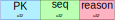
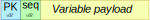

Dicey Transfer Format
=====================

The **Dicey Transfer Format** *(DTF)* is a serialisation format used by Dicey interernally to encode the data 
and messages that are sent between a server and its clients.

DTF is a simple **binary** format that strives to be quick to parse, while still being easy to inspect and reason about.

.. warning:: 
    **DTF is NOT intended to be a general purpose serialisation format**, and it is not advisable to use it to exchange 
    data between different systems.
    
    DTF assumes that **both the encoder and decoder run on the same architecture and OS**, 
    which allows it to make certain assumptions about the data that would not be possible in a more general format. 

Packets
~~~~~~~

DTF is based on the concept of **packets**, self contained units of data that can be sent over the Dicey protocol. 

Every packet begins with a *preamble* containing two four bytes fixed fields:

|packet|

*PK* 
    **Packet Kind**, an ``uint32`` value that identifies the type of the packet. Valid types are: 

        +-------------+---------------+--------------+-------------------+-----------------+
        | Packet Type | Decimal Value | ASCII Value  | Packet Description| Packet Format   |
        +=============+===============+==============+===================+=================+
        | ``HELLO``   | 1             |              | Hello packet      | Hello           |
        +-------------+---------------+--------------+-------------------+-----------------+
        | ``BYE``     | 2             |              | Bye packet        | Bye             |
        +-------------+---------------+--------------+-------------------+-----------------+
        | ``EVENT``   | 33            | '!'          | Event message     | Message         |
        +-------------+---------------+--------------+-------------------+-----------------+
        | ``RESPONSE``| 58            | ':'          | Response message  | Message         |
        +-------------+---------------+--------------+-------------------+-----------------+
        | ``GET``     | 60            | '<'          | Get message       | Message         |
        +-------------+---------------+--------------+-------------------+-----------------+
        | ``SET``     | 62            | '>'          | Set message       | Message         |
        +-------------+---------------+--------------+-------------------+-----------------+
        | ``EXEC``    | 63            | '?'          | Exec message      | Message         |
        +-------------+---------------+--------------+-------------------+-----------------+

*Seq*
    **Sequence Number**, an ``uint32`` value that identifies the sequence number of a packet. 
    The sequence number is used to match responses to requests, must always be increasing. In case of overflow, 
    the sequence number should wrap around to 2. 0 is reserved for the `HELLO` packet.

    More specifically, **all client-initiated packets must have an even sequence number**, with ``0`` always being a 
    ``HELLO`` packet. **All server-initiated packets (events) must have an odd sequence number** instead.

Packets are variable in size, and come in three different types, identified by the *first byte of the packet*:

.. _hello_packets:

**HELLO packets (1)**:
    |hello|

    Hello packets are used by the client and server to handshake and establish a connection.

    The hello packet has a fixed sequence number of 0, and contains the maximum version of the protocol supported by the
    sender. The client first sends a hello packet to the server, alongside a proposed version. The server will then
    either reply with a HELLO of its own, containing a version that it supports, or a BYE packet if the maximum version
    proposed by the client is older than the minimum version supported by the server.

    *Version*
        **Version** is a ``uint32`` field that represents a protocol version.
        The field itself is divided into two 16-bit halves:

            *Major*
                The major version of the protocol. This value is incremented when a change is made to the protocol that
                is not backwards compatible.

            *Revision*
                An incremental number that indicates that a change has been made to the protocol that is backwards 
                compatible (usually a bug fix or clarification). 

.. _bye_packets:

**BYE packets (2)**:
    |bye|

    Bye packets are used to signal the end of a connection. 

    *Reason*
        **Reason** is an ``uint32`` that indicates the reason for the disconnection. 
        The following values are valid:

        +---------------------+---------------+-------------------------------------+
        | Reason              | Decimal Value | Description                         |
        +=====================+===============+=====================================+
        | SHUTDOWN            | 1             | Client or server are shutting down  |
        +---------------------+---------------+-------------------------------------+
        | ERROR               | 2             | A serious error has happened        |
        +---------------------+---------------+-------------------------------------+

.. _messages:

**Messages (GET, SET, EXEC, RESPONSE, EVENT)**:
    |message|

    Messages comprise most of the packets sent over the Dicey protocol. These packets are used to transfer data and trigger
    actions across process boundaries.

    *dlen*
        **Data Length** is an ``uint32`` field that indicates the length in bytes of the *trailer* field.

    *trailer*
        The *trailer* field is a variable length field that contains the actual data of the message. 

        |trailer|

        *Path*
            A unique identifier for the message. The path is a null-terminated string (see the *path* type for more info)

        *Selector*
            A pair of strings that uniquely identifies an element in a given trait. 
            The selector is represented as two consecutive null-terminated strings.

        *Value*
            The value of the message, or none if the message is a ``GET``. See the :ref:`value section <value>` below for more info. 

.. _value:

.. |message| image:: ../_static/message.svg
  :align: middle
  :alt: Dicey message overview

.. |trailer| image:: ../_static/trailer.svg
  :align: middle
  :alt: Dicey message trailer overview