=====================
Dicey Transfer Format
=====================

The **Dicey Transfer Format** *(DTF)* is a serialisation format used by Dicey interernally to encode the data 
and messages that are sent between a server and its clients.

DTF is a simple **binary** format that strives to be quick to parse, while still being easy to inspect and reason about.

.. warning:: 
    **DTF is NOT intended to be a general purpose serialisation format**, and it is not advisable to use it to exchange 
    data between different systems.
    
    DTF assumes that **both the encoder and decoder run on the same architecture and OS**, 
    which allows it to make certain assumptions about the data that would not be possible in a more general format. 

Packets
-------

DTF is based on the concept of **packets**, self contained units of data that can be sent over the Dicey protocol. 

Every packet begins with a *preamble* containing two four bytes fixed fields:

|packet|

*PK* 
    **Packet Kind**, an ``uint32`` value that identifies the type of the packet. Valid types are: 

        +-------------+---------------+--------------+-------------------+-----------------+
        | Packet Type | Decimal Value | ASCII Value  | Packet Description| Packet Format   |
        +=============+===============+==============+===================+=================+
        | ``HELLO``   | 1             |              | Hello packet      | Hello           |
        +-------------+---------------+--------------+-------------------+-----------------+
        | ``BYE``     | 2             |              | Bye packet        | Bye             |
        +-------------+---------------+--------------+-------------------+-----------------+
        | ``EVENT``   | 33            | '!'          | Event message     | Message         |
        +-------------+---------------+--------------+-------------------+-----------------+
        | ``RESPONSE``| 58            | ':'          | Response message  | Message         |
        +-------------+---------------+--------------+-------------------+-----------------+
        | ``GET``     | 60            | '<'          | Get message       | Message         |
        +-------------+---------------+--------------+-------------------+-----------------+
        | ``SET``     | 62            | '>'          | Set message       | Message         |
        +-------------+---------------+--------------+-------------------+-----------------+
        | ``EXEC``    | 63            | '?'          | Exec message      | Message         |
        +-------------+---------------+--------------+-------------------+-----------------+

*Seq*
    **Sequence Number**, an ``uint32`` value that identifies the sequence number of a packet. 
    The sequence number is used to match responses to requests, must always be increasing. In case of overflow, 
    the sequence number should wrap around to 2. 0 is reserved for the `HELLO` packet.

    More specifically, **all client-initiated packets must have an even sequence number**, with ``0`` always being a 
    ``HELLO`` packet. **All server-initiated packets (events) must have an odd sequence number** instead.

Packets are variable in size, and come in three different types, identified by the *first byte of the packet*:

.. _hello_packets:

**HELLO packets (1)**:
    |hello|

    Hello packets are used by the client and server to handshake and establish a connection.

    The hello packet has a fixed sequence number of 0, and contains the maximum version of the protocol supported by the
    sender. The client first sends a hello packet to the server, alongside a proposed version. The server will then
    either reply with a HELLO of its own, containing a version that it supports, or a BYE packet if the maximum version
    proposed by the client is older than the minimum version supported by the server.

    *Version*
        **Version** is a ``uint32`` field that represents a protocol version.
        The field itself is divided into two 16-bit halves:

            *Major*
                The major version of the protocol. This value is incremented when a change is made to the protocol that
                is not backwards compatible.

            *Revision*
                An incremental number that indicates that a change has been made to the protocol that is backwards 
                compatible (usually a bug fix or clarification). 

.. _bye_packets:

**BYE packets (2)**:
    |bye|

    Bye packets are used to signal the end of a connection. 

    *Reason*
        **Reason** is an ``uint32`` that indicates the reason for the disconnection. 
        The following values are valid:

        +---------------------+---------------+-------------------------------------+
        | Reason              | Decimal Value | Description                         |
        +=====================+===============+=====================================+
        | SHUTDOWN            | 1             | Client or server are shutting down  |
        +---------------------+---------------+-------------------------------------+
        | ERROR               | 2             | A serious error has happened        |
        +---------------------+---------------+-------------------------------------+

.. _messages:

**Messages (GET, SET, EXEC, RESPONSE, EVENT)**:
    |message|

    Messages comprise most of the packets sent over the Dicey protocol. These packets are used to transfer data and trigger
    actions across process boundaries.

    *dlen*
        **Data Length** is an ``uint32`` field that indicates the length in bytes of the *trailer* field.

    *trailer*
        The *trailer* field is a variable length field that contains the actual data of the message. 

        |trailer|

        *Path*
            A unique identifier for the message. The path is a null-terminated string (see the *path* type for more info)

        *Selector*
            A pair of strings that uniquely identifies an element in a given trait. 
            The selector is represented as two consecutive null-terminated strings.

        *Value*
            The value of the message, or none if the message is a ``GET``. See the :ref:`value section <values>` below for more info. 

.. _values:

Values
------

All Dicey messages (with the exeption of ``GET``) contain a serialised payload.

This payload contains an arbitrary message, depending on the signature of the target operation, signal or property.

The payload is the **Dicey value** tagged union, which represents a variant type:

|value|

Dicey supports both simple and complex data. The **type** of a ``value`` is encoded by an 8 bit unsigned integer.

Accepted values for a Dicey type are:

+----------+-----+-------+-------------------------------+
| Name     | Hex | ASCII | Description                   |
+==========+=====+=======+===============================+
| UNIT     | 24  | $     | Unit type.                    |
+----------+-----+-------+-------------------------------+
| BOOL     | 62  | b     | Boolean type.                 |
+----------+-----+-------+-------------------------------+
| BYTE     | 63  | c     | Byte type.                    |
+----------+-----+-------+-------------------------------+
| FLOAT    | 66  | f     | Floating-point type.          |
+----------+-----+-------+-------------------------------+
| INT16    | 6E  | n     | 16-bit signed integer type.   |
+----------+-----+-------+-------------------------------+
| INT32    | 69  | i     | 32-bit signed integer type.   |
+----------+-----+-------+-------------------------------+
| INT64    | 78  | x     | 64-bit signed integer type.   |
+----------+-----+-------+-------------------------------+
| UINT16   | 71  | q     | 16-bit unsigned integer type. |
+----------+-----+-------+-------------------------------+
| UINT32   | 75  | u     | 32-bit unsigned integer type. |
+----------+-----+-------+-------------------------------+
| UINT64   | 74  | t     | 64-bit unsigned integer type. |
+----------+-----+-------+-------------------------------+
| ARRAY    | 5B  | [     | Array type.                   |
+----------+-----+-------+-------------------------------+
| TUPLE    | 28  | (     | Tuple type.                   |
+----------+-----+-------+-------------------------------+
| PAIR     | 7B  | {     | Pair type.                    |
+----------+-----+-------+-------------------------------+
| BYTES    | 79  | y     | Bytes type.                   |
+----------+-----+-------+-------------------------------+
| STR      | 73  | s     | String type.                  |
+----------+-----+-------+-------------------------------+
| PATH     | 40  | @     | Path type.                    |
+----------+-----+-------+-------------------------------+
| SELECTOR | 25  | %     | Selector type.                |
+----------+-----+-------+-------------------------------+
| ERROR    | 65  | e     | Error type.                   |
+----------+-----+-------+-------------------------------+

.. note:: The values of the Dicey type enumeration have been deliberately picked in order to be easy to read in a hex dump.

Unit
^^^^

The **Unit** type represents an empty value. It has a size of 0, and can be used as a placeholder whenever no value is needed.

It largely overlaps with types such as ``void``, ``()``, ``None``, which the bindings may use to represent it when suitable.

Byte
^^^^

A simple 8-bit unsigned integer that represents a byte, akin to `std::byte` in C++ or `byte` in Java.

Bool
^^^^

An 8-bit boolean type. The only two valid values are 0 and 1, which represent `false` and `true` respectively.

Float
^^^^^

A 64-bit floating point value, encoded as a IEEE 754 double precision floating point number. Dicey has no support for 
32 and 16 bit floating point values.

Integers
^^^^^^^^

Dicey supports integers both signed and unsigned between 16 to 64 bits. The integer types are encoded as-is, i.e. 
however the target architecture represents them. Given the overall irrelevance of big-endian systems in modern times,
Dicey currently does not support big-endian values.

Array
^^^^^

|array|

A *flexible-sized* array of values of a given type. Compared to tuples, array have the advantage of not having to store
a ``typeid`` for each value and are often reinterpreted into the native array or list types in bindings.

.. note:: 
    Arrays only enforce a single type for the top-level elements. Arrays with inner type of array, tuple or pair may 
    contain values of different types, as long as the top-level container is the same.

    For instance, an array of arrays may contain an array of integers, an array of floats, an array of tuples, all at 
    the same time, as long as they are all arrays.

Tuple
^^^^^

|tuple|

A *flexible-sized* struct which may contain values of different types. Tuples are encoded as a sequence of values, each 
one preceded by its own ``typeid``. Tuples are the main structured data type used in Dicey, and can be used to represent
records, structs, tuples, etc. If all values share the same type, it is recommended to use an array instead, which is 
more efficient and usually easier to work with.

For all intents and purposes, tuples behave like an array of variants.

Pair
^^^^

|pair|

A specialised tuple that only contains two element. Useful for representing key-value pairs, or other binary relationships.

Bindings for dynamic typed languages may choose to represent array of pairs as dictionaries or hashmaps.

Bytes
^^^^^

|bytes|

A sequence of bytes, akin to `&[u8]` in Rust or `bytes` in Python. Bytes are used to represent arbitrary binary data,
specified as a length-prefixed sequence of bytes. The length is encoded as a ``uint32``.

String (``str``)
^^^^^^^^^^^^

|string|

A ``NUL``-terminated (0) string of characters (``u8``). The encoding of the string is usually assumed to be UTF-8. While
the C library largely treats strings as arrays of bytes, bindings often assume UTF-8. 

Path
^^^^

An ASCII string that uniquely refers to an object in the system. Paths are useful for reflection and meta-operations, as
they give elements a way to refer to other objects on the system.

Path as a type is identical to a string, with the crucial difference of only accepting:

- ASCII alphanumeric characters (a-z, A-Z, 0-9)
- The underscore character `_`
- The dot character `.`
- The slash character `/`
- The dash character `-`

Paths must always start with a slash ``/``, may not contain two consecutive slashes, and may not end with one.

Selector
^^^^^^^^

|selector|

A pair of ``NUL``-terminated strings that uniquely identify an element in a given trait.

The first string is the trait name, while the second string is the element name. Selectors are used in both message headers
to identify the target of the message, and in payloads for meta-operations and reflection.

The trait string must only contain:
- ASCII alphanumeric characters (a-z, A-Z, 0-9)
- The dot character `.`

and must begin with a lowercase letter (i.e. ``dicey.Registry``). A trait name may not end with a dot or contain two
consecutive dots.

The element string is a PascalCase string, and may only contain ASCII alphanumeric characters (a-z, A-Z, 0-9).

Error
^^^^^

|error|

A structure representing an error. Errors are used to signal that an operation has failed, with an arbitrary 16-bit 
error code and an optional NUL-terminated error message.

If the error message is not present, the error has a size of 2 bytes (i.e. the error code). 
 
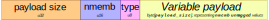

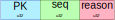

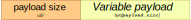

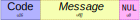

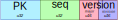

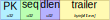

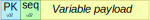

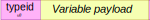

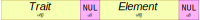

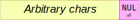

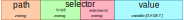

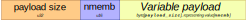

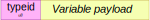
