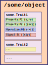

========
Overview
========

[Dicey]_ is a C library that implements simple, portable and highly opinionated way to do *Inter-Process Communication (IPC)*.
Dicey provides ready-to-use tools that allow existing programs to expose functionalities to other processes running on the 
same machine.

Objects
-------

    Dicey Objects reside on one path and have one or more traits. 

Dicey is built around the concept of **objects**, lightweight entities capable of exposing a set of properties and operations
to clients. Objects are identified by a unique **path**, which clients can use to access the functionalities exported by one
or more **traits** implemented by the object. 

For all intents and purposes, a Dicey Object can be represented as a tuple of the form:

    ``(path, [traits])``

Traits
------

**Traits** loosely represent a concept and associates the properties, events and operations which are related to it to a
given *trait name*. 
Every object may implement one or more traits; in the same fashion, a trait may be implemented by multiple entities. 

Elements
--------

Each trait contains one or more **elements**, small pieces of functionality identified by unique name. 

Elements can be of three types:

**Operations**
    Operations that can be executed by clients. Operations have input and output parameters.

**Properties**
    Values with specific types that can either be read or written by clients (if not *read-only*).

**Signals**
    Emitted by the server, they can be used to notify interested clients that some specific event happened on a given object.  

A client can send requests to the server in order to inspect and manipulate its entites.

.. [Dicey] Someday we will hopefully have an URL here.